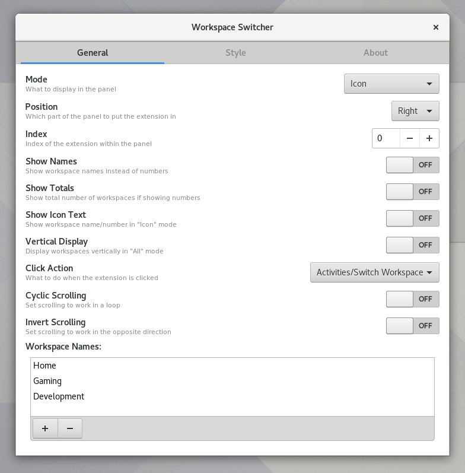
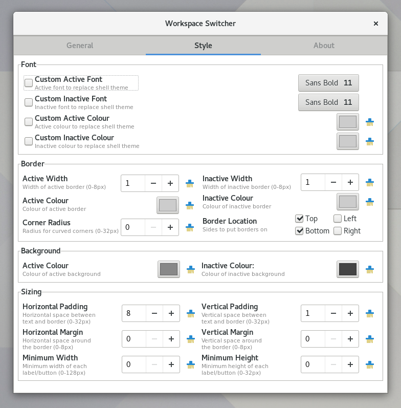
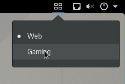

# About
Workspace Switcher is an extension for the Gnome Shell to allow you to view and
switch the current workspace. It aims to be highly customisable, allowing a
range of diffirent display types with further options for position, appearance,
and behaviour.

# Customisation
Workspace Switcher sports a wide range of customisation options including:
- 3 display modes
	- Icon
	- Current workspace indicator
	- Buttons for all workspaces
- 3 methods of switching workspace
	- Dropdown menu
	- Activities view
	- Direct workspace buttons
- Fully customisable panel position
- Ability to rename workspaces from preferences menu
- Custom font family, size, and colour
- Custom background and border colours and styles

The full set of options can be seen below:

# Panel Display
Including fonts, colours, and sizes/thicknesses, there is potential for a huge range of appearances. Below are some examples of the basic display types:

# Switching Workspace
There are 3 ways to change workspace, based partly off the display mode you use:
1. **Dropdown Menu:** This is the "classic" option, like that provided by the native Workspace Indicator extension. With this option enabled, clicking the workspace indicator in any mode will display a dropdown menu to let you switch workspace.

	

2. **Activities Menu:** Similar to the dropdown menu, clicking the workspace indicator will open the Gnome Activities view, allowing you to rearrange windows on your workspaces, or just switch workspace. This option is available for the icon or single workspace display modes.

3. **Direct Switching:** Available only when displaying all workspaces, this allows the name/number of each workspace to behave as a button which allows you to switch directly from one workspace to another.

	

### Workspace Scrolling
In addition to the above methods of switching workspace, you can also enable scrolling on the workspace indicator. With the mouse over the workspace indicator, scrolling up or down with your mouse wheel (you can invert the direction) can also be used to sequentially change to the next/previous workspace. Cyclic scrolling can also be enabled to allow scrolling from the last workspace directly back to the first.

# Installation
The extension is not yet available on the Gnome Shell Extensions site, so for the mean time a manual installation is required:
1. `git clone https://github.com/tomha/gnome-shell-extension-workspace-switcher workspace-switcher@tomha.github.com`(Make sure you use that destination folder name.)
2. `cp -r workspace-switcher@tomha.github.com ~/.local/share/gnome-shell/extensions/` (Or clone directly to this location.)
3. Restart the Gnome Shell:
	- On a X session, press `ALT + F2`, type `r`, and press `ENTER`
	- On a Wayland session, log out and back in again.
4. Activate the extension:
	- Enable it in the Extensions section of Gnome Tweak Tools
	- Run the command `gnome-shell-extension-tool -e workspace-switcher@tomha.github.com.`
